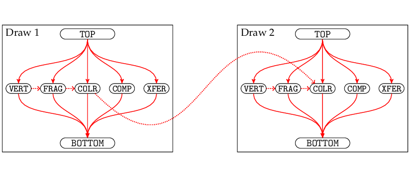
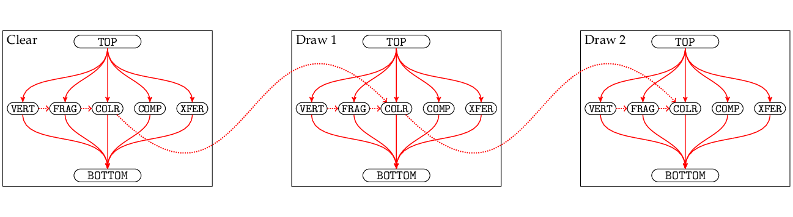
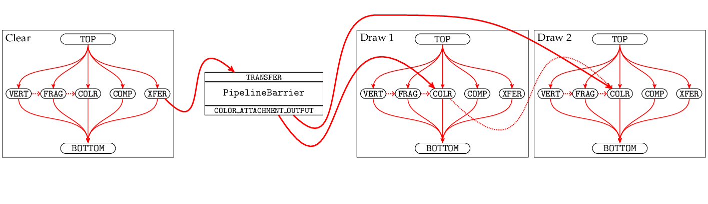
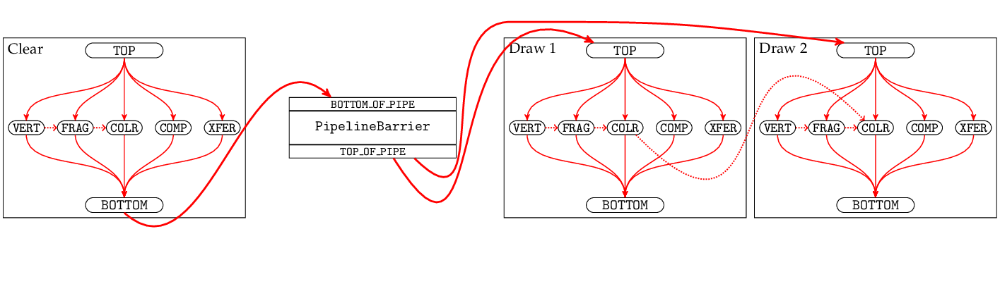
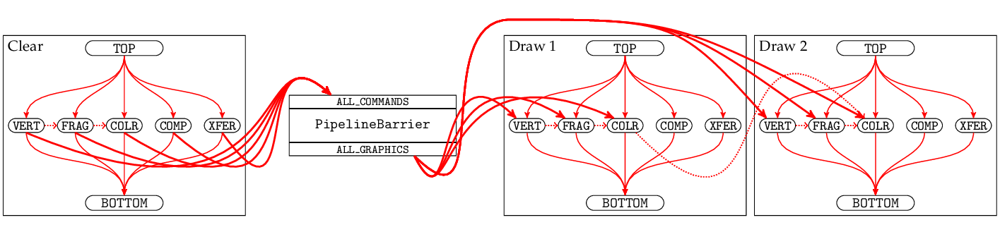

# 04-clear

This sample uses the GPU to clear an image to a particular color, then copies the image into host-visible memory, then reads it from the CPU.

Compared to previous samples, this is remarkably complicated and requires a lot of new features. Before getting to any rendering, we'll start by exploring the concept of synchronisation.

### Execution dependencies

Sequences of commands are recorded into command buffers, and sequences of command buffers are submitted to queues. A Vulkan implementation could simply execute the commands one after another in the sequence you provide them (called *API order*). But GPUs are very parallel and very pipelined - they can process different stages of multiple draw calls simultaneously, and can process multiple draw calls at a single stage simultaneously, in an attempt to keep the hardware as busy as possible. To work efficiently like that, the GPU has to be allowed to overlap and reorder the commands.

Tile-based renderers are a good example of the importance of reordering: They will collect a large sequence of draw calls, then split the viewport into small tiles of maybe 32x32 pixels, and for each tile they will work out which triangles (from all of the draw calls combined) will overlap that tile. Then they run pretty much the whole rendering pipeline on a single tile at once - vertex shading (maybe), fragment shading, blending onto the framebuffer, etc, for all the draw calls that touch that tile - or perhaps they run it on a few tiles simultaneously, and they only start on a new tile once they've finished a previous tile. That means the order of execution of a draw call is determined largely by the location of its triangles in the viewport, and bears little resemblance to the order it was submitted in.

Obviously there has to be some limit on reordering - for example, if the GPU reorders your 'clear framebuffer' call into the middle of your frame's draw calls, half your objects will disappear and you will be unhappy. *Execution dependencies* are Vulkan's way of defining those limits: if operation B has an execution dependency on operation A, then A must finish before B can start. Some execution dependencies are created implicitly when using the Vulkan API, but in many cases you will have to create explicit dependencies to get the correct behaviour.

Consider a very simple command buffer with two draw calls:

```cpp
vkBeginCommandBuffer(...);
vkCmdBeginRenderPass(...);

vkCmdDraw(...); // Draw 1
vkCmdDraw(...); // Draw 2

vkCmdEndRenderPass(...);
vkEndCommandBuffer(...);
vkQueueSubmit(...);
```

We can visualise it like this:



For each draw call, this shows a few of the stages that might be involved: `VERT` (vertex shader), `FRAG` (fragment shader), `COLR` (color attachment output), `COMP` (compute shader), `XFER` (transfer). (In reality there are many more stages for indirect draws, tessellation, geometry shaders, and depth/stencil operations, but they won't all fit on the diagram.) (Ignore the `TOP` and `BOTTOM` for a moment, we'll come back to them later.)

The dotted red lines indicate item-level ordering constraints, which don't count as full execution dependencies: an individual triangle has to pass through the vertex shader before the fragment shader, and a sample has to pass through the fragment shader before being blended onto the framebuffer's color attachment. When two draw calls are rendering to the same pixel in the framebuffer, Vulkan guarantees those framebuffer updates will happen in API order; we indicate that with a dotted line between the two `COLR` stages to show the order they run in per pixel.

Apart from those item-level constraints, there are no restrictions on reordering the commands. The GPU could vertex-shade a triangle from draw call 1, then a triangle from draw call 2, then another from draw call 1. It could blend a pixel from draw call 2 onto the framebuffer, before blending a different pixel from draw call 1, then another different pixel from draw call 2.

If the vertex shaders and fragment shaders don't write to memory, apart from their final write to the framebuffer, then the implicit ordering of framebuffer updates might be all that you need - it doesn't matter how things get reordered internally since the observable behaviour will remain consistent.

A more complicated case is when you modify memory in other ways, for example with a clear command:

```cpp
vkBeginCommandBuffer(...);

vkCmdClearColorImage(...);

vkCmdBeginRenderPass(...);
vkCmdDraw(...);
vkCmdDraw(...);
vkCmdEndRenderPass(...);

vkEndCommandBuffer(...);
vkQueueSubmit(...);
```

Now we can visualise it like:



`vkCmdClearColorImage` clears an image in the `XFER` stage. We can see there is no dependency between `XFER` and the draw call's `COLR`. That is a problem; if we're clearing the framebuffer that the draw call is going to draw onto, then we really need to make sure the clear completes first.

To achieve that, we use *pipeline barriers* to add explicit execution dependencies:

```cpp
vkBeginCommandBuffer(...);

vkCmdClearColorImage(...);

vkCmdPipelineBarrier(...,
	VK_PIPELINE_STAGE_TRANSFER_BIT,
	VK_PIPELINE_STAGE_COLOR_ATTACHMENT_OUTPUT_BIT,
	...);

vkCmdBeginRenderPass(...);
vkCmdDraw(...);
vkCmdDraw(...);
vkCmdEndRenderPass(...);

vkEndCommandBuffer(...);
vkQueueSubmit(...);
```



`vkCmdPipelineBarrier` has created an execution dependency between the `XFER` stage (`VK_PIPELINE_STAGE_TRANSFER_BIT`) of the command before the barrier, and the `COLR` stages (`VK_PIPELINE_STAGE_COLOR_ATTACHMENT_OUTPUT`) of the commands after the buffer. That's enough to guarantee that the entire framebuffer will have been cleared before the draw call tries to use it.

When `vkCmdPipelineBarrier` is called from outside a render pass, it will create execution dependencies from each command before the barrier to each command after the barrier, where "before" and "after" are based on the API order. That applies to all commands in the current queue, including all render passes and all submitted command buffers. When `vkCmdPipelineBarrier` is called from *inside* a render pass, it will only create dependencies for commands within the current subpass.

Now we can come back to the `TOP` and `BOTTOM` nodes in the diagram. These don't represent real stages in the hardware - instead, `TOP` (`VK_PIPELINE_STAGE_TOP_OF_PIPE_BIT`) is an imaginary stage that finishes before any other stage starts, and `BOTTOM` (`VK_PIPELINE_STAGE_BOTTOM_OF_PIPE_BIT`) is an imaginary stage that starts every other stage has finished. We can create execute dependencies between these imaginary stages:

```cpp
vkBeginCommandBuffer(...);

vkCmdClearColorImage(...);

vkCmdPipelineBarrier(...,
	VK_PIPELINE_STAGE_BOTTOM_OF_PIPE_BIT,
	VK_PIPELINE_STAGE_TOP_OF_PIPE_BIT,
	...);

vkCmdBeginRenderPass(...);
vkCmdDraw(...);
vkCmdEndRenderPass(...);

vkEndCommandBuffer(...);
vkQueueSubmit(...);
```



There is no longer a direct execution dependency from `XFER` to `COLR`, but there is a chain of dependencies from `XFER` to `BOTTOM` to `TOP` to `COLR`, so it will still work correctly. However, this is also creating a chain from `XFER` to `VERT`, meaning that the GPU can't even start vertex-shading the draw calls until the clear has completed. That may harm performance compared to the fine-grained dependencies between specific stages.

`vkCmdPipelineBarrier` isn't restricted to single stages; you can specify a bitmask with multiple source or destination stages. There are also the special values `ALL_COMMANDS` and `ALL_GRAPHICS`, which create dependencies connected to all stages or all graphics stages (i.e. all except transfer and compute):

```cpp
vkBeginCommandBuffer(...);

vkCmdClearColorImage(...);

vkCmdPipelineBarrier(...,
	VK_PIPELINE_STAGE_ALL_COMMANDS_BIT,
	VK_PIPELINE_STAGE_ALL_GRAPHICS_BIT,
	...);

vkCmdBeginRenderPass(...);
vkCmdDraw(...);
vkCmdEndRenderPass(...);

vkEndCommandBuffer(...);
vkQueueSubmit(...);
```



Again this is likely to result in worse performance than fine-grained dependencies, so it should only be used when you really need to force everything to run sequentially.

### Other execution dependencies

You can create execution dependencies with `vkCmdSetEvent`/`vkCmdWaitEvents`. These work very similarly to `vkCmdPipelineBarrier`, but they only affect commands before the `SetEvent` and commands after the `WaitEvents`, meaning they won't force any unnecessary ordering on commands in the middle. That makes them suitable for long-distance dependencies, perhaps between a compute job submitted early in the frame (which would ideally run asynchronously alongside a lot of subsequent commands) and a draw call that uses it much later in the frame.

```cpp
vkBeginCommandBuffer(...);

vkCmdDispatch(...);

vkCmdSetEvent(..., event, VK_PIPELINE_STAGE_COMPUTE_BIT);

vkCmdBeginRenderPass(...);
vkCmdDraw(...);
vkCmdDraw(...);
vkCmdWaitEvents(..., event, VK_PIPELINE_STAGE_COMPUTE_BIT, VK_PIPELINE_STAGE_VERTEX_SHADER_BIT);
vkCmdDraw(...);
vkCmdEndRenderPass(...);

vkEndCommandBuffer(...);
vkQueueSubmit(...);
```

TODO: diagram.

TODO: subpasses.

TODO: semaphores.

TODO: by-region.

TODO: ...

### Memory dependencies

TODO

### Layout transitions

TODO

### Everything else

TODO
